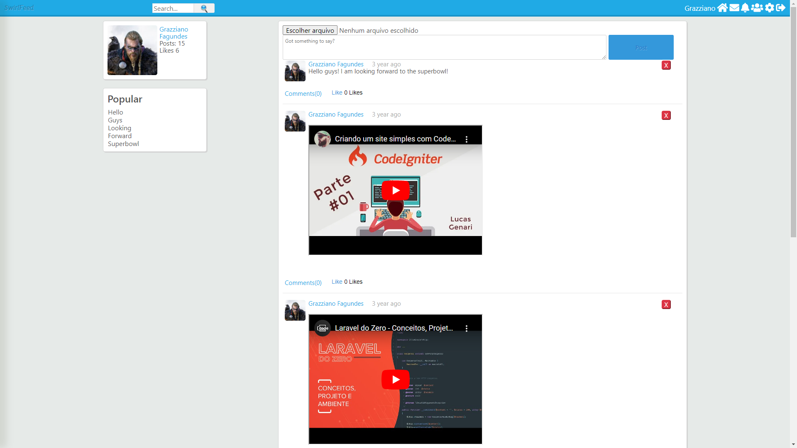
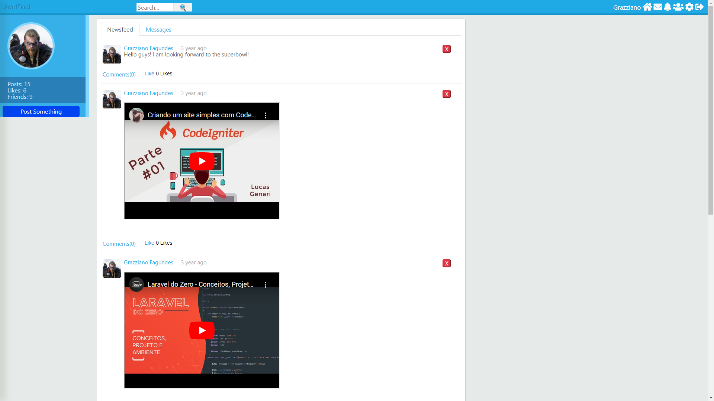
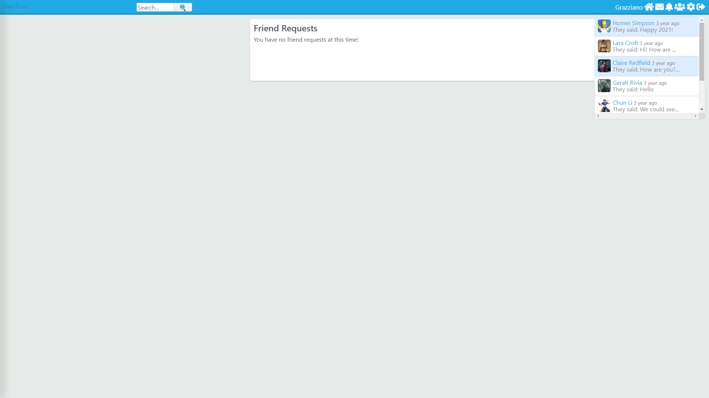

# SocialNetwork SwirlFeed

**SwirlFeed** é um site de rede social desenvolvido em PHP, onde os usuários podem se conectar, compartilhar posts, fotos e interagir com amigos.

## 🚀 Tecnologias Utilizadas

- **Linguagem de Programação**: PHP
- **Banco de Dados**: MySQL
- **Frontend**: HTML, CSS, JavaScript
- **Servidor**: Apache

## 📦 Instalação

Siga os passos abaixo para rodar o projeto localmente:

1. Clone o repositório:
    ```bash
    git clone https://github.com/Grazziano/SocialNetwork.git
    cd SocialNetwork
    ```

2. Configure o banco de dados MySQL:

    - Crie um banco de dados no MySQL.
    - Importe o arquivo `social_network.sql` para criar as tabelas necessárias:
      ```bash
      mysql -u root -p social_network < social_network.sql
      ```

3. Atualize o arquivo de configuração do banco de dados (`config.php`):

    <!-- ```php
    define('DB_HOST', 'localhost');
    define('DB_USER', 'seu_usuario');
    define('DB_PASS', 'sua_senha');
    define('DB_NAME', 'swirlfeed');
    ``` -->
    ```php
    $con = mysqli_connect("localhost", "root", "", "social_network");
    ```

4. Mova o projeto para o diretório do servidor Apache (por exemplo, `/var/www/html` no Linux ou `htdocs` no XAMPP/WAMP).

5. Acesse o site no navegador:
    ```
    http://localhost/socialNetwork
    ```

## 🛠️ Funcionalidades

- Criação de perfil de usuário
- Postagens de texto e imagem
- Curtidas e comentários
- Sistema de amigos
- Mensagens privadas

## 📸 Imagens da Aplicação

Aqui estão algumas capturas de tela da interface do SwirlFeed:

<table>
  <tr>
    <td></td>
    <td></td>
  </tr>
  <tr>
    <td></td>
    <td></td>
  </tr>
  <tr>
    <td></td>
  </tr>
</table>

## 📝 Licença

Este projeto está licenciado sob a [Licença MIT](LICENSE).
